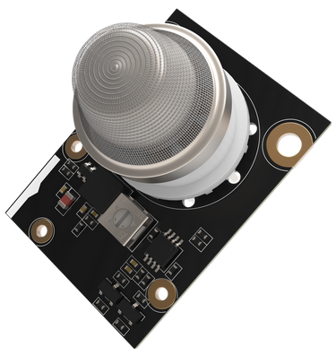

| <center></center>  |  | [](https://github.com/RAKWireless/RAK-MQx-Library/actions) | <center></center> |
| -- | -- | -- | -- |

# RAK MQx sensor modules

This library is used with the RAk12004, RAK12008, RAK12009 and other gas sensor modules.    
This library provides easy to use functions to setup the RAKwireless MQx sensor modules and read the gas concentration in ppm. These modules use the ADC121C021 analog to digital converter with a I2C interface.   
The ADC121C021 is a low-power, monolithic, 12-bit, analog-to-digital converter. The device features an I2C compatible serial interface. The ADC121C021's Alert feature provides an interrupt that is activated when the analog input violates a programmable upper or lower limit value.
This library provides basic support for the ADC121C021 ADC.    

# Documentation

* [*RAKwireless RAK12004 Gas sensor*](https://docs.rakwireless.com/Product-Categories/WisBlock/#wisblock-io)
* [*RAKwireless RAK12008 CO2 Gas sensor (coming soon)*](https://docs.rakwireless.com/Product-Categories/WisBlock/#wisblock-io)
* [*RAKwireless RAK12009 Gas sensor (coming soon)*](https://docs.rakwireless.com/Product-Categories/WisBlock/#wisblock-io)
* [Library Repository](https://github.com/RAKWireless/RAK-MQx-Library) - Product repository for the MQx Sensor Modules.

# Installation

In Arduino IDE open Sketch->Include Library->Manage Libraries then search for RAK-MQx.    

In PlatformIO open PlatformIO Home, switch to libraries and search for RAK-MQx. 
Or install the library project depend by adding 
```log
lib_deps =
  rakwireless/RAKwireless MQx library
```
into **`platformio.ini`**

For manual installation download the archive, unzip it and place the RAK-MQx-Library folder into the library directory.    
In Arduino IDE this is usually <arduinosketchfolder>/libraries/    
In PlatformIO this is usually <user/.platformio/lib>     

# Usage

The library provides an ADC class, which allows to read gas concentrations from the RAKwireless MQx sensor modules. Check out the examples how to read gas concentrations from a MQ2 gas sensor with the RAK12004.    

## This class provides the following methods:

**ADC121C021();**     
Constructor for ADC interface.    

**bool begin(uint8_t addr, TwoWire &theWire);**    
Init the ADC121C021 device.

Parameters:    

| Direction | Name      | Function | 
| --------- | ----      | -------- |
| in        | addr      | I2C address of the ADC121C021  | 
| in        | &theWire  | I2C interface to be used  | 
| return    |           | If the initialization succeeds return true else return false  | 

## MQx functions
**void setVoltageResolution(float value);**    
Set the resolution voltage

Parameters:    

| Direction | Name      | Function | 
| --------- | ----      | -------- |
| in        | value      | if use 5V supply for MQx sensor to set value 5.0 if use 3.3V supply for MQx sensor to set value 3.3   | 

**float getVoltageResolution();**     
Gets the resolution voltage configuration. 

Parameters:    

| Direction | Name      | Function | 
| --------- | ----      | -------- |
| return        |       | the value of the resolution voltage configuration    | 

**void setR0(float R0 = 10);**    
Set the resistance R0 of the sensor at a known concentration without the presence of other gases, or in fresh air.

Parameters:    

| Direction | Name      | Function | 
| --------- | ----      | -------- |
| in        | R0      | the resistance of the sensor at fresh air.   | 

**float getR0();**    
Gets the R0 parameter. 

Parameters:    

| Direction | Name      | Function | 
| --------- | ----      | -------- |
| return        |       | R0 in kOhm    | 

**void setRL(float RL = 10);**    
Set the resistance RL of the sensor at a known concentration without the presence of other gases, or in fresh air.

Parameters:    

| Direction | Name      | Function | 
| --------- | ----      | -------- |
| in        | RL      | the resistance of the sensor at fresh air.   | 

**float getRL();**     
Gets the RL parameter. 

Parameters:    

| Direction | Name      | Function | 
| --------- | ----      | -------- |
| return        |       | RL in kOhm    | 

**void setA(float K);**     
Set the slope of the line

Parameters:    

| Direction | Name      | Function | 
| --------- | ----      | -------- |
| in        | K      | the slope of the line configuration   | 

**float getA();**    
Get the slope of the line parameter

Parameters:    

| Direction | Name      | Function | 
| --------- | ----      | -------- |
| return        |       | the slope of the line configuration    | 

**void setB(float b);**    
Set config Y intercept parameter

Parameters:    

| Direction | Name      | Function | 
| --------- | ----      | -------- |
| in        | b      | Y intercept   | 

**float getB();**     
Get the Y intercept parameter configuration 

Parameters:    

| Direction | Name      | Function | 
| --------- | ----      | -------- |
| return        |       | Y intercept parameter | 

## User functions
**float getSensorVoltage();**
Gets the voltage of sensor output.

Parameters:    

| Direction | Name      | Function | 
| --------- | ----      | -------- |
| return        |       | voltage V | 

**float calibrateR0(float ratioInCleanAir);**    
Set the ratio of RS/R0 in clean air

Parameters:    

| Direction | Name      | Function | 
| --------- | ----      | -------- |
| in        | ratioInCleanAir | ratioInCleanAir = RS/R0 | 
| return        |       | R0 MQx sensor resistance in the clean air  | 

**void setRegressionMethod(uint8_t method);**     
Set the regression method 

Parameters:    

| Direction | Name      | Function | 
| --------- | ----      | -------- |
| in        | method      | set the regression method if=1 use Exponential else Linear Exponential: PPM = A*(RS/R0)^B Linear: PPM = pow(10, (log10(RS/R0)-B)/A)   | 

**uint8_t getRegressionMethod();**    
Gets the regression method

Parameters:    

| Direction | Name      | Function | 
| --------- | ----      | -------- |
| return        |       | the regression method | 

**float readSensor();**    
Read the MQx sensor data to PPM 

Parameters:    

| Direction | Name      | Function | 
| --------- | ----      | -------- |
| return        |       | MQx sensor data PPM | 

## Direct ADC functions
**uint8_t readConfigRegister();**    
Read the Configuration Register data, the register address is 0x02.    

Parameters:    

| Direction | Name      | Function | 
| --------- | ----      | -------- |
| return    |           | Configuration Register data  | 

**uint8_t readAlertStatus();**    
Get the current status of the alert flag If the flag is set, the low or high alert indicators are set as appropriate. 

Parameters:    

| Direction | Name      | Function | 
| --------- | ----      | -------- |
| return    |           | alert status  | 

**uint8_t readAlertLowStatus();**     
Get the current status of the Lower Range Alert Flag. `readAlertStatus()` must be called to update this value. 

Parameters:    

| Direction | Name      | Function | 
| --------- | ----      | -------- |
| return    |           | Lower Range Alert Flag status  | 

**uint8_t readAlertHighStatus();**    
Get the current status of the Over Range Alert Flag. `readAlertStatus()` must be called to update this value.

Parameters:    

| Direction | Name      | Function | 
| --------- | ----      | -------- |
| return    |           | Higher Range Alert Flag status  | 

**void clearAlertStatus();**    
Clears the alert low and alert high flags. 

Parameters:    

| Direction | Name      | Function | 
| --------- | ----      | -------- |
|     |           |   | 

**void configCycleTime(uint8_t cycletime);**    
Sets the Configuration Register of Cycle Time bits value,when the value set to zeros, the automatic conversion mode is disabled. This is the case at power-up. 

Parameters:    

| Direction | Name      | Function | 
| --------- | ----      | -------- |
| in        | cycletime      | the conversion intervals of convert time can be 0-7 value Conversion Interval Typical fconvert (ksps) 0 Automatic Mode Disabled 0 1 Tconvert x 32 27 2 Tconvert x 64 13.5 3 Tconvert x 128 6.7 4 Tconvert x 256 3.4 5 Tconvert x 512 1.7 6 Tconvert x 1024 0.9 7 Tconvert x 2048 0.4  | 

**uint8_t readCycleTime();**     
Read the Configuration Register of Cycle Time bits value. 

Parameters:    

| Direction | Name      | Function | 
| --------- | ----      | -------- |
| return        |       | the Cycle Time bits value from the Configuration Register  | 

**void configAlertHold(configType alertHold);**     
Sets the Alert Hold bit enable or disable. 

Parameters:    

| Direction | Name      | Function | 
| --------- | ----      | -------- |
| in        | alertHold | Enable:enable alert hold, Disable:disable alert hold.  | 

**uint8_t readAlertHold();**    
Get the Alert Hold bit status from the Configuration Register 

Parameters:    

| Direction | Name      | Function | 
| --------- | ----      | -------- |
| return        |       | the value of the Alert Hold bit   | 

**void configAlertFlag(configType alertflag);**     
Config the Alert Flag Enable bit,This controls the alert status bit [D15] in the Conversion Result register.    

Parameters:    

| Direction | Name      | Function | 
| --------- | ----      | -------- |
| in        | alertflag | Enable or Disable.    | 

**uint8_t readAlertFlag();**    
Get the bit value of Alert Flag Enable Status from the Configuration Register

Parameters:    

| Direction | Name      | Function | 
| --------- | ----      | -------- |
| return        |  | the bit value of Alert Flag Enable    | 

**void configAlertPin(configType alertpin);**    
Config the alert pin output enable or disable when ALERT come.

Parameters:    

| Direction | Name      | Function | 
| --------- | ----      | -------- |
| in        | alertpin | Enable or Disable     | 

**uint8_t readAlertPin();**    
Get the Alert Pin Enable Status from the Configuration Register.

Parameters:    

| Direction | Name      | Function | 
| --------- | ----      | -------- |
| return        |  | the Alert Pin Enable Status register value    | 

**void configPolarity(polarityType polarity);**     
Config the alert pin output level polarity when ALERT come. 

Parameters:    

| Direction | Name      | Function | 
| --------- | ----      | -------- |
| in        | polarity | High or Low      | 

**uint8_t readPolarity();**     
Get the alert pin output level polarity configuration.

Parameters:    

| Direction | Name      | Function | 
| --------- | ----      | -------- |
| return        |  | the polarity configuration      | 

**void setAlertLowThreshold(uint16_t threshold);**     
Sets the lower limit threshold value. 

Parameters:    

| Direction | Name      | Function | 
| --------- | ----      | -------- |
| in        | threshold | threshold value      | 

**uint16_t readAlertLowThreshold();**    
Get the value of the lower limit threshold value configuration

Parameters:    

| Direction | Name      | Function | 
| --------- | ----      | -------- |
| return        |  | the lower limit threshold value      | 

**void setAlertHighThreshold(uint16_t threshold);**    
Sets the upper limit threshold value.

Parameters:    

| Direction | Name      | Function | 
| --------- | ----      | -------- |
| in        | threshold | the upper limit threshold value      | 

**uint16_t readAlertHighThreshold();**      
Get the value of the upper limit threshold value configuration 

Parameters:    

| Direction | Name      | Function | 
| --------- | ----      | -------- |
| return        |  | the upper limit threshold value      | 

**void setHysteresis(uint16_t hysteresis);**     
Config the hysteresis value

Parameters:    

| Direction | Name      | Function | 
| --------- | ----      | -------- |
| in        | hysteresis | hysteresis value      | 

**uint16_t readHysteresis();**     
Get the hysteresis value configuration 

Parameters:    

| Direction | Name      | Function | 
| --------- | ----      | -------- |
| return        |  | the hysteresis value configuration       | 

**uint16_t readLowestConversion();**      
Gets the Lowest Conversion result recorded from the Lowest Conversion Register.

Parameters:    

| Direction | Name      | Function | 
| --------- | ----      | -------- |
| return        |  |  the lowest conversion result value | 

**void clearLowestConversion();**    
Clears the Lowest Conversion register value. 

**uint16_t readHighestConversion();**    
Gets the Highest Conversion result recorded from the Highest Conversion Register. 

Parameters:    

| Direction | Name      | Function | 
| --------- | ----      | -------- |
| return        |  |  the highest conversion result value | 

**void clearHighestConversion();**     
Clears the Highest Conversion register value. 

**uint16_t getAdcValue();**    
Read the ADC conversation value from the Conversion Register. 

Parameters:    

| Direction | Name      | Function | 
| --------- | ----      | -------- |
| return        |  |  ADC conversation result | 

